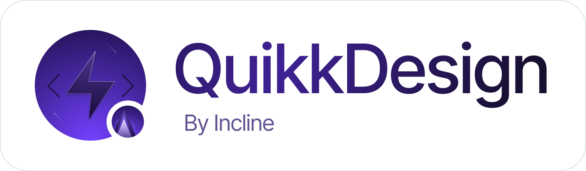

<picture>
  <source media="(prefers-color-scheme: dark)" srcset="./public/banner-dark.png">
  
</picture>

# QuikkDesign
Quikkdesign is a simple HTML, CSS, and JS code editor built with React, Tailwind, Zustand, and Codemirror. It provides a convenient interface for editing and previewing code in real-time. Whether you are building a website, developing a new feature, or simply playing around with code, Quikkdesign makes it easy to create and modify web pages or components.

## Installation
### Option 1: Clone the repository

# Quikkdesign

Quikkdesign is a simple HTML, CSS, and JS code editor built with React, Tailwind, Zustand, and Codemirror. It provides a convenient interface for editing and previewing code in real-time. Whether you are building a website, developing a new feature, or simply playing around with code, Quikkdesign makes it easy to create and modify web pages or components.

## Installation
### Option 1: Clone the repository

1.  Clone the repository:
    bashCopy code
    ``` git clone https://github.com/username/quikkdesign.git``` 
    
2.  Install dependencies:
    bashCopy code
    ```cd quikkdesign
    npm install``` 
    
3.  Start the development server:
    bashCopy code
    ```npm start```


### Option 2: Use GitHub Desktop

1.  Install GitHub Desktop from the [GitHub Desktop website](https://desktop.github.com/).
2.  In GitHub Desktop, click the "Clone a repository" button and select "Clone with URL."  
3.  Enter the repository URL: [https://github.com/username/quikkdesign.git](https://github.com/username/quikkdesign.git)
4.  Choose a local path to clone the repository.
5.  Click "Clone."
6.  Open the local repository in a terminal or command prompt.
7.  Install dependencies:
    bashCopy code
    ```npm install``` 
    
8.  Start the development server:
    bashCopy code
    ```npm run dev``` 
    
9.  Open the app in your browser at [http://localhost:3000](http://localhost:3000/).
`
## Usage

Quikkdesign provides a simple interface for editing HTML, CSS, and JS code. You can use the editor to create and modify web pages or components.

### Supported Features

-   **Syntax highlighting** for HTML, CSS, and JS makes it easy to identify different parts of your code.
-   **Auto-indentation** helps keep your code organized and easy to read.
-   **Code autocompletion** saves time and reduces errors by suggesting possible code completions as you type.
-   **Live preview** lets you see your changes in real-time, without having to switch back and forth between the editor and the browser.
-   **Dark mode** is easy on the eyes and reduces eye strain.
-   **Save and load code snippets** allows you to easily save and load code snippets for later use.
-   **Fullscreen mode** provides a distraction-free editing experience.
-   **Keyboard shortcuts** allow you to work more efficiently.

## Technologies Used

Quikkdesign is built with a number of modern web technologies, each of which plays an important role in making the editor fast, responsive, and user-friendly.

### React

React is a popular JavaScript library for building user interfaces. Quikkdesign is built with React because it makes it easy to create reusable components, manage state, and render changes to the DOM efficiently. React's Virtual DOM also helps ensure that Quikkdesign runs smoothly and without lag.

### Tailwind

Tailwind is a utility-first CSS framework that makes it easy to style components quickly and consistently. Quikkdesign is built with Tailwind because it provides a robust set of pre-built classes that can be easily customized or extended to create unique styles.

### Zustand

Zustand is a lightweight state management library for React. Quikkdesign is built with Zustand because it provides a simple and efficient way to manage the state of the editor, such as the current code being edited, the active tab, and the theme.

### Codemirror

Codemirror is a versatile and powerful text editor for the web. Quikkdesign is built with Codemirror because it provides a rich set of features such as syntax highlighting, code autocompletion, and live preview.

## Contributing

Contributions are welcome! If you find a bug or have a feature request, please open an issue. If you want to contribute code, please fork the repository and submit a pull request.
